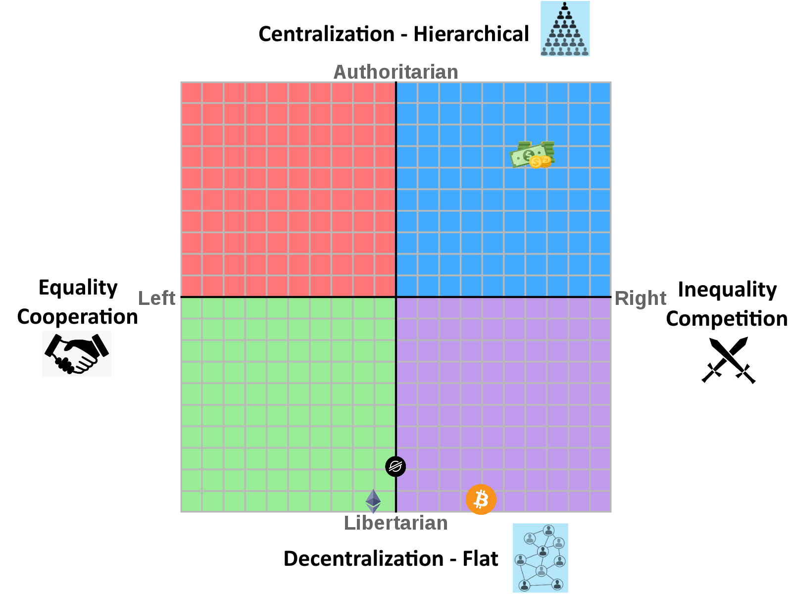
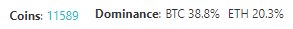

# The Leftist Rebuttal to Leftist Cryptocurrency Hostility

I want to put together this guide as the amount of misinformation from leftists regarding cryptocurrency is becoming far to prevalent. I fully understand why there is a distaste for much of the space. There are some problematic aspects of it. However, I want to highlight why the opportunity and potential good far outweighs the negatives that exist within the space. I want to carefully dissect the most common talking points I hear, and provide *very needed* nuance to complicated subjects. 

## A Mental Framework - The Political Compass

Is the political compass an oversimplifying mental model for complex political concepts and opinions? **Yes**

However, it's also still pretty decent at giving something visual to understand and become familiar with. We can map on some concepts that closely align with this framework and get an idea of *where* cryptocurrency exists, politically.

> Anarcho-Capitalists / Lib-right types love cryptocurrency right? Doesn't sound leftist to me.

I somewhat disagree. I think cryptocurrency isn't inherently right wing, but it is almost universally libertarian. Cryptocurrency and distributed ledger technology (DLT) is primarily about decentralization and majority consensus. Everyone participates in the same system, and it can change as long as the majority of participants want it to. It's fundamentally democratic, even if not entirely evenly or perfectly.

So, in my opinion:

Projects exist in a spectrum towards the bottom of the compass in the "libertarian" end. I also want to stress that networks and their rules are only half of the story. Part of the general "ethos" of the project and people involved should count toward how this is mapped. After all, it's the humans that ascribe the meaning onto these systems. 

Now, this does mean that leftists that exist more in the "Auth-Left" category may still not find the value or the potential here. However, I hope to also make a case within these points that this technology grants us for better human coordination at scale and solves for some of the issues inherent within a decentralized flat way of structuring society. 

## Bitcoin =/= Cryptocurrency

One of the more frustrating things that I hear discussed about cryptocurrency goes something like this:

> Cryptocurrency is bad and here's why. Bitcoin is X. Bitcoin has Y. Bitcoin does Z.

There isn't another perfect analogy for this, but I think it's similar to saying the same about automobiles, and then making every comparison to the Model T and/or the Hummer. The Model T for the reason that it's the first mass produced successful car and the Hummer due to it being a gas guzzling oversized beast. Comparing all cryptocurrencies to one single highly flawed version is missing the point in the same way. 

Note, I also understand that it's not fully unreasonable to look at the project with the most market-share and trying to understand it as a proxy for the rest of the space. This is especially given the amount of coins and tokens that today. 

## Cryptocurrency is all fake

> Why on earth would I use magic internet money that's all fake. It isn't money, it's just numbers.

Well, I have a few issues with this. The most obvious of which is that any fiat currency is fake. The only difference is that it's propped up by the government(s) that want to use it. Think to the amount of physical money you use on a day to day basis. For most, it's close to zero. 

> But they have the physical money at the bank!

Do they? Banks almost universally use what's called "fractional reserve banking", meaning that they only need to keep a portion of your money on hand. For reference in the United States, before 2020, *that number was 10%, and currently it is **0%***.

***All** money is fake.*

## Fiat Currency

> Ok, so it might be fake, but it is at least backed by nation states. Because of X, Y, and Z problems I still have with cryptocurrency... I still don't want to adopt it.

Here's the problem with that. That stance is basically one of two things. 

1. I will accept the status quo of our current money system and implicitly accept it, weather or not I like it. 
2. I hate money so much that I want to abolish the very concept and I refuse to participate as much as humanly reasonable (which is, ya know, fair).

For those in the first camp: I'm of the opinion that our current system is far more exploitative, gives too much control to unelected bureaucrats, and implicitly also has far reaching environmental effects that aren't as simple to understand such as a soft peg on petroleum and funding the United States military. 

For those in the second camp: I'll explain my thoughts thoroughly in a "Other Issues" below.

Getting to the bottom of every issue with our current money system is beyond the scope of this post. However, **I think it is absolutely crucial to understand the rot in our current system in order to know why people are so passionate about advocating for alternatives.**

Here's some videos and articles related to some of the above. I urge you to at least watch one, and if it has to be any of them, please make it the first one here.

- [Who Controls our Money? - ColdFusion](https://www.youtube.com/watch?v=mQUhJTxK5mA)
- [How is Money Created? - ColdFusion](https://www.youtube.com/watch?v=mzoX7zEZ6h4)
- [Worst Ponzi Ever! - Coin Bureau](https://www.youtube.com/watch?v=L_f6R0DHNH0) 
- [The Deficit Myth - OneDime](https://www.youtube.com/watch?v=75udjh6hkOs)   
- [How Petrodollars Affect the U.S. Dollar](https://www.investopedia.com/articles/forex/072915/how-petrodollars-affect-us-dollar.asp)

## Energy Consumption - Proof of Work

> The amount of energy it takes to run the bitcoin network is as much as some countries! Making a transaction is like burning 100 barrels of oil in a field of kittens! Making that NFT cost an acre of rainforest to mint!

Ok, some hyperbole joking aside, this is actually a pretty big issue. However, I do still think isn't approached in an honest way, and it can easily look like waste without any benefit. Note that *this* issue is mostly a Bitcoin problem, so I will refer to it as a Bitcoin problem.

Understanding this means we need to understand decentralized consensus and the original method: proof of work. [Here's a fairly simple explainer that will do more justice than my even more simple explanation](https://www.coindesk.com/learn/2020/12/16/what-is-proof-of-work/). 

### A quick detour explainer of the energy mechanics of proof of work
Basically, all of these miners are using this power to solve an arbitrary problem of somewhat arbitrary difficulty. Hard to solve, easy to check, like a sudoku puzzle. The network makes the problem harder as more computers are trying to solve it to earn the currency reward. The inverse is true as well. The network goal is a "block time", meaning the difficulty is going to be roughly the time it takes everyone to solve it in X time. Bitcoin's target is 10 minutes per block. It's a bunch of game theory and rewards to keep people honest and the network in check. 

So, what's the benefit? The more wasteful it is, the more resilient the network is. Say I really hate Bitcoin and I want to disrupt it. One of the only attack vectors is what's called a 51% attack. If I own the majority hashrate, I make all of the blocks going forward. I can't change the history, but I can prevent new transactions, and I can do a "double spend" attack. That's about it.

So, if Bitcoin is using as much power as Argentina to create a block. I need the computer infrastructure and energy to match and a little extra. Compare that to any other website or services you've heard about going down from companies with billions of dollars of infrastructure and talent. Centralized systems have centralized control and centralized points of failure. They are far more brittle, weak, and corruptible. 

> Ok, so I still hate how much power Bitcoin uses.

Yep, me too. I don't like Bitcoin personally. Proof of work is very very wasteful especially at scale, There's also the issue of ASIC computers being made specifically to mine leading to more physical computer waste and fewer individuals securing the network.

> Alright, but Ethereum ALSO uses a lot of power and uses Proof of Work too! Why are you singling out Bitcoin here? Are you biased?

Bitcoin is a borderline cult and getting Bitcoin folks to meaningfully address the energy issue is going to get you shunned. Ethereum has a culture far more willing to change, and will be moving to a Proof of Stake system. Expect an estimated drop of power consumption by 99.95%. 

> But they've been promising Eth 2 forever and it'll probably be years before it gets off the ground.

Personally I would be shocked if it took another full year for the merge to happen, but I don't know. With Ether alone being worth roughly a half trillion dollars at time of writing, I think it's important they get it done right. I'm willing to look past a systems faults that the people involved fully acknowledge and work to change. 

I have a few more positive notes related to Bitcoin mining as well:

- The cheapest energy sources are generally renewables. Bitcoin has been increasingly becoming powered by renewable energy as mine operators look toward cheaper and more efficient solutions to mine.
- Renewables are notorious for being unreliable energy sources. Sometimes the wind doesn't blow, the clouds cover the sky, etc. There's a lot of excess power that gets created that will be wasted as it isn't used. It's becoming an increasingly common tactic to have Bitcoin miners siphon off excess power, and be turned off during high load. This extra money from mining can make renewable projects more profitable.
  - I understand how neo-liberal that solution is and it does put a sour taste in my mouth even pointing it out, but it is still a positive. 
- ASIC churn is slowing down quite a bit. Hardware is lasting longer and is efficient enough to use for longer periods of time.
- Proof of work is **NOT** the only consensus method!

More resources:

- [Blockchain energy consumption: Debunking the misperception of Bitcoin and blockchain climate impact](http://datadrivenlab.org/climate/blockchain-energy-consumption-debunking-the-misperceptions-of-bitcoins-and-blockchains-climate-impact/)
- [FACT CHECK: Bitcoin Mining is BAD For The Climate!? - Coin Bureau](https://www.youtube.com/watch?v=DidAwxWaDKI)
  - Not a perfect take, but overall good. Grain of salt and all that.

## Consensus - The Alternatives

> So, you've been hinting that Proof of Work isn't the only thing and is problematic. What's your solution then, huh?

The typical standard alternative nowadays is called **Proof of Stake**. Let me be clear, that this system isn't without it's flaws. It's safe to say that no method will be perfect. [Here's a list of a ton of them to see what interesting methods people have come up with so far.](https://hackernoon.com/consensuspedia-an-encyclopedia-of-29-consensus-algorithms-e9c4b4b7d08f)

Proof of stake works similarly to the proof of work concept. Instead of computers competing to solve a problem, they put a certain amount "at stake" in order to create blocks. Often times this stake is locked for a set period of time before you can get your coins back. If you act maliciously, your staked coins can be partly or fully removed. Often there are systems of delegating so you don't need to run anything yourself, but you put your coins in a shared pool and get a cut of the validator rewards, possibly with a cut going to the validator. This is a more cooperative approach instead of a competitive one. 

This also has an added benefit that it's often far more expensive to get control of a majority of the network compared to proof of work. That sounds crazy but think about it. Instead of needing to own half of the computer power making blocks, you would need to own half of the staked coins. In fiat terms, that is INCREDIBLY expensive. 

> The issues though? 

- The system functions effectively like a very high interest savings account, think anywhere between 2%-20% annually is pretty normal.
  - This has a "rich get richer" effect.
  - Miners need to pay for power and equipment in the real world, and thus need to sell and distribute coins, unlike a staker.
- Distributing coins to users initially can be challenging. Who gets them? 
  - Some chains solve for this by being proof of work and then changing to proof of stake later.
- [A few other details in this article outline weaknesses of both PoW and PoS](https://robertgreenfieldiv.medium.com/vulnerability-proof-of-work-vs-proof-of-stake-f0c44807d18c)

Other systems make different tradeoffs, often by incorporating small layers of trust (Stellar). Some forgo great blockchain features like smart contracts in order to work incredibly well as a currency (Nano). If you take nothing else away from this, remember that the cryptocurrency space is not a monolith and it's going to have weird growing pains as people figure out what works and what doesn't. 

## Grifts - NFTs and Dumb Tokens

> But have you seen Doge, Shiba Inu, Safemoon, XYZ Token? These things have sold for a gorrilion dollars and how dumb is that? This whole space is a joke and a scam.

Alright, let's acknowledge that a large portion of the cryptocurrency space is all of those things. Denying that would be stupid. CoinGecko currently lists 11,000+ coins and tokens and a lot of those are going to be dead or scam projects. However, there's some important things to remember.

- This entire space is still relatively new. Bitcoin was created in 2009 and Ethereum was created in 2015 for example.
  - As a result, it's hard to gauge the "value" of these coins and tokens. 
  - Overall everything is still highly speculative. It's likely a project you invest in could become worthless or become incredibly valuable.
- Right now, cryptocurrency is only barely becoming mainstream. 
  - The public understanding of how it works is low, and thus people are likely to make poor choices in what projects they decide to use or become invested in.   
  - A lot of it is hard to understand. The user experience is getting better by the day, but it's still quite inaccessible. 
- People are just absolutely beaten down by much of our capitalist structures. 
  - Think about it. Someone seeing large dollar figures of shady and stupid projects making returns of 1000%+ based on ponzi-like tokens might just throw money at even stupider things to see what might stick even if they know it's a scam or dumb.
  - I feel like that's more of an indictment on how poorly we care for so many people in our society that they need to do speculation based gambling in order to maybe get enough money to change their lives for the better.

> But what about these ugly NFT collections of dumb generated animal art. I see some of them being sold for TWO gorrilion dollars a pop. They're just money laundering.

Sure, some of that is probably money laundering. Some people are trying to scam people for money or pass off other people's work as their own and try to sell it. But, art based money laundering isn't a new thing, it's just taking a slightly different form today.

There is some incredibly genuine enthusiasm for the space weather or not *you* think it's dumb. There's also plenty of clout chasers that see these expensive NFTs as a wealth-flex and like it for that reason (See: Supreme brand). And I'll reiterate from above, some folks are just trying to flip a blockchain jpeg for percentage returns on their purchase in order to gain some money to survive. It's not for me and probably not for you either. It's almost certainly a bubble, but I'm not about to rationalize it any further than that.

Now that we've knocked out **art** NFTs, let's step back for a second and make sure we understand Non-Fungible Tokens.

They're effectively just a small bit of data on the blockchain that is provably owned by a wallet, most often expressed as a smart contract. Most of the NFT craze is for these digital art pieces that are effectively URLs to the picture. However, there can be a large set of use cases for some arbitrary data assigned to a wallet / user. Examples listed may or may not be reasonable *at this moment in time* or require further context as to why it might be better on a blockchain. 

- Web Domains 
  - [Unstoppable](https://unstoppabledomains.com/)
  - [ENS](https://ens.domains/)
- Digital Identity
- Software or Copyright Licenses
- Event Tickets
- Stock Certificates 
- Home Deed / Car Title / etc
- In-game Items

## Decentralization - The Centralization Strikes Back!

> Ok, but look at all of you nerds creating cryptocurrency exchanges. They're just banks but not regulated enough! Hypocrites! Also, these "crypto-banks" are unsafe too! I heard of Mt. Gox and that whole crazy story and people lost a lot of money and/or cryptocurrency!

Would I prefer to be paid in a cryptocurrency instead of a check? Absolutely. Would I prefer that vendors offer payment options in various cryptocurrencies? Again, yes. Even getting paid in a dollar-pegged stablecoin would mean that I can use that in decentralized exchanges instead of centralized ones.

Until then, people like need a way to go back and forth between dollars and crypto, and these exchanges are a good way of handling that. Right now, these exchanges are relatively safe. Still, everyone is encouraged to not leave funds on exchanges. As they say: "*Not your keys, not your coins*".

> Did you say dollar-pegged crypto? Aren't you trying to get rid of fiat money? Aren't those centralized too?

Yep, but the world won't change overnight. Some are "backed" by USD and equivalents similar to what a bank would do, but without fractional reserve banking and without FDIC insurance. Issuers like Tether and USDC have a lot of control to control their supply. Tether is incredibly sketchy, and this specific part of crypto could use regulations to ensure the centralized entity isn't doing anything shady. Algorithmic or crypto-collatoralized stablecoins however should probably be left alone and are more in the spirit of cryptocurrency in general. 

> But the ETH DAO hack? You mean a bunch of insiders can fix them losing money, but not others? That sounds centralized to me.

We'll get to DAOs in a second, but let's shed some context on this thing. 

Imagine you're a new country trying to make a new currency for yourself. It's going well enough but you want to get as many people involved in governing your new country. You start crowdfunding your new currency. About **14%** of all the money in circulation makes it into the bank holding this crowd fund. Some clever person finds a way into the bank and drains all of the funds. 

So, you ask everyone: "This bad thing happened and it's really bad, like country ruining bad. That's an insane amount of money for a thief to make off with. Do you guys want to go back before he robbed the bank and start over from there?" - Unsurprisingly, the majority of people agreed.

Here's the thing though, maybe you're a person that says: "Well, that sucks, but the code on the blockchain is the law. That thief just did what he was allowed to do. I don't want to make this change."
You can still live in that world, it's called Ethereum Classic. Ethereum forked and went one way, and Ethereum Classic stayed on the same trajectory. If more people agreed with the sentiment above, it would have more development, users, investors, etc.

*Things can be always be changed as long as there is social consensus to do so.*

## DAOs?

> What's a DAO though?

It is a Decentralized Autonomous Organization. The word Autonomous is a little misleading, most are not, but they can be fully or partly. In short, it's taking the concept of an organization like a government, corporation, charity, enthusiast group, or similar and flattening the power structure. These are held together with the glue of decentralized funding, voting, and other tools to coordinate much larger groups of people more equally than ever before. 

DAOs, in my opinion, are going to be one of the biggest game changers and best things to happen for society and people at large. If you've heard of [Dunbar's number](https://en.wikipedia.org/wiki/Dunbar%27s_number), this is how we can better overcome this limitation. This new way of organizing could change the minds of some Auth-Left folks that think we need strong top-down organizations to ensure an equitable society. This concept is still quite new, but I strongly consider you try joining some DAOs if anything out there exists that speaks to you. 

## Other Issues 

> Companies, Governments, Banks, and other entities are generally avoiding Cryptocurrency and Distributed Ledger Tech. And why haven't I seen a bunch of interesting new applications for blockchain if it's so revolutionary? 

Here's the thing, it's because **decentralized technology is primarily about cutting out middlemen.** Why on earth would the people that make plenty of profit by being a centralized entity adopt technology or solutions that would eventually cut them out? They wouldn't, because of course they wouldn't.

You aren't going to see anything terribly "new" here, and that's the wrong expectation in my opinion. What's revolutionary is the ability to use internet based services and technology in a way that cuts out powerful centralized entities and corporations that are exploiting users for profit directly or indirectly. Some of these are going to be easier to implement and get right, some may never fully be workable enough. Even if some decentralized versions of a service can't usurp a centralized one, the threat of one could keep the large power structures working honestly for fear of losing that power.

> But aren't we supposed to become a stateless, classless, **moneyless** society? Marx said that and I like that dude.

Yeah Karl is really cool and I basically agree. Here's the deal. Decentralized money and organizing helps to subvert state power, and to a smaller extent class power. I don't think Marx could have envisioned this specific kind of money from his time and the implications of it. To him, I would assume it's an extension of state and corporate power and from that perspective I agree. 

Here's the thing though. We don't and can't just get rid of money overnight. I also don't think completely removing the concept of a "medium of exchange" is a good thing either as it does simplify a lot of human coordination. If you are still in the camp of getting rid of money, I still thing this is one step closer to that goal even if it is technically adopting a different one.

> People think crypto is private but I heard it isn't. You mean people can just track my history even easier now?

Kind of, it's complicated. Most blockchains are pseudo-anonymous in the way that most accounts on the internet are. If you let people know that you own an address, you aren't anonymous anymore and your history is viewable to that person.

However, there are some privacy chains and solutions that exist. I don't like that part about using cryptocurrency as an actual currency for real world use, but you may feel differently. Some things absolutely should be public, but not everything. [Here's a list of some of them if you're interested](https://www.coingecko.com/en/categories/privacy-coins), and I did another huge post a while back on the topic.

## Closing Thoughts

If this post is any indication, it's that the [bullshit asymmetry principle](https://en.wikipedia.org/wiki/Brandolini%27s_law) is alive and well. I fully understand why folks on the left bashing a lot of the stuff that exists in the cryptocurrency ecosystem. There is a lot of easy, low hanging fruit to make fun of. Hopefully though you can understand why I think this is ultimately good for society and to think very hard about these narratives being pushed by those that have a lot to lose by the USD and other central bank currencies being taken out back and put down. Thanks for taking the time to better understand regardless of how you feel about everything now. 